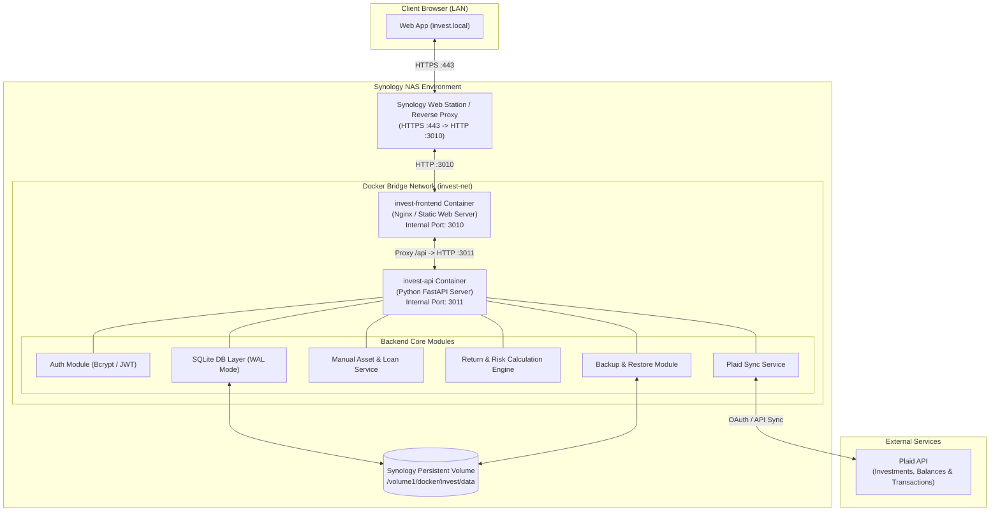
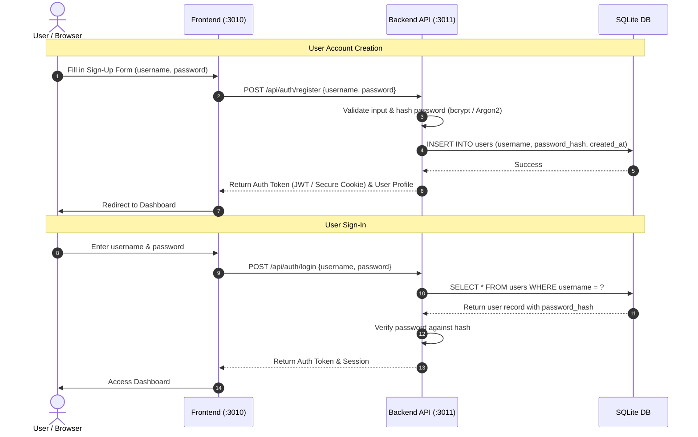
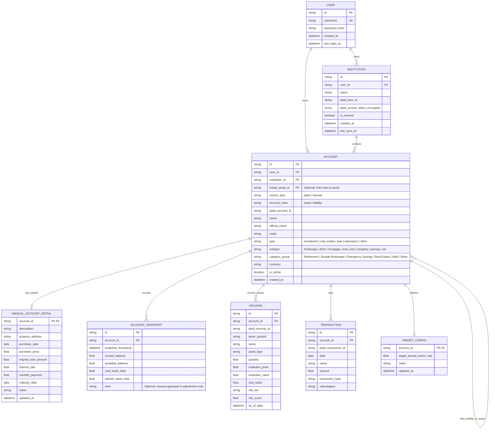

# Investment Tracking Application — System Design Document (DESIGN.md)

## 1. Executive Summary & Goals

The Investment Tracking Application is a self-hosted, personal finance and portfolio management system designed to run as two distinct Docker containers (Frontend and Backend API) on a local Synology NAS server. It aggregates automated investment accounts via financial APIs (e.g., Plaid) and supports manually tracked assets and liabilities (such as real estate, physical assets, mortgages, and loans). It tracks total net worth over time, measures historical investment performance against user-defined target return rates, inspects granular holdings, calculates risk profiles, requires secure user authentication, and operates strictly on-demand without unwanted background scraping.

### Core Objectives
1. **User Authentication & Authorization:** Simple sign-up and sign-in flow with username/password, storing salted & hashed passwords securely in SQLite, with session/token management.
2. **Net Worth & Balance Sheet Tracking:** Real-time summary and historical tracking of aggregate net worth, combining liquid investments, manual assets, and liabilities/loans.
3. **Manual Assets & Loans (Real Estate & Mortgages):** Track real estate, vehicles, private equity, and physical holdings alongside linked loans (e.g., mortgages, auto loans) with automatic property equity computation (Market Value − Loan Balance).
4. **Flexible Performance Analytics:** Returns computed across 1M, YTD, 1Y, 3Y, 5Y, and Lifetime intervals with interactive line charts and comparative tabular breakdowns for individual accounts and blended portfolios.
5. **Multi-Account & Blended Filtering:** Instant performance aggregation across all accounts, custom subsets (e.g., "Retirement", "Taxable Brokerage", "Real Estate", "Emergency Savings"), or single accounts.
6. **Target Return Rate Comparison:** User-defined target annual growth rates per account with visual and tabular tracking of actual vs. target performance saved in the database.
7. **Granular Holdings Breakdown:** Product and ticker-level analysis with asset allocation percentages, share counts, market values, and cost bases.
8. **Risk Profile Engine:** Account-level and blended portfolio risk ratings (5-tier: *Very Low, Low, Moderate, High, Very High*) based on asset classification and equity concentration.
9. **On-Demand Synchronization & Manual Valuation Updates:** User-initiated sync updates for Plaid connections (with historical catch-up) and clean manual valuation adjustment forms for physical assets and loans.
10. **Data Persistence & Backups:** Local SQLite database storing user profiles, historical snapshots, holdings, and targets with one-click `.sqlite` backup download and restore capabilities.
11. **Dual-Container Synology Architecture:** Frontend (port `3010`) and Python FastAPI Backend (port `3011`) running in separate Docker containers, integrated behind Synology Web Station / Reverse Proxy at `https://invest.local` (port `443` -> `3010`).

---

## 2. System Architecture & Topology



### Key Components

1. **Frontend Container (`invest-frontend` — Port `3010`):**
   - Modern, responsive, dark-mode/glassmorphic single-page application.
   - Proxies `/api/*` requests internally to `http://invest-api:3011/api/*`.
   - UI Views & Modules:
     - **Overview Dashboard (`/overview`):** Net worth KPIs, category distribution cards, and 5-year timeline.
     - **Unified Account & Performance (`/account`):** Single-account, multi-account, and blended portfolio performance, target curve comparison ($ and %), Chart/Table toggles, Holdings breakdown & asset allocation donut, and "Edit Account" configuration dialog.
     - **Real Estate & Loans (`/real-estate`):** Property cards, linked mortgage equity calculations, and LTV gauges.
     - **Modals:** Authentication, Unified Add Account (3 tabs: Plaid Connect, Categorized Manual Account Picker, Manual Debt Account), Edit Account settings, Valuation & Loan Payment loggers, Database Backup & Restore.

2. **Backend API Container (`invest-api` — Port `3011`):**
   - High-performance **Python (FastAPI)** application.
   - Authentication module (`/api/auth/*`).
   - Plaid integration service for automated accounts (`/api/plaid/*`).
   - Manual Asset & Loan service (`/api/manual-assets/*`).
   - Analytics and Return Calculation Engine (`/api/analytics/*`).
   - Backup & Restore service (`/api/backups/*`).

3. **Persistence Layer (Database):**
   - **SQLite** database running with Write-Ahead Logging (WAL) for concurrency and fast reads/writes.
   - Stored on the Synology host persistent volume (`/volume1/docker/invest/data/invest.db`).

4. **Networking & Reverse Proxy:**
   - Client accesses `https://invest.local` on standard HTTPS port 443.
   - Synology Reverse Proxy terminates SSL and forwards traffic to `http://localhost:3010`.

---

## 3. User Authentication & Authorization Flow



---

## 4. Detailed Feature Specifications

### 4.1 Net Worth & Balance Sheet Tracking
- Aggregates assets (liquid investments, cash, real estate, manual assets) minus liabilities (mortgages, loans).
- Formulas:
  $$\text{Total Net Worth} = \sum \text{Invested Assets} + \sum \text{Manual Assets} - \sum \text{Loans \& Liabilities}$$
- Records snapshot entries on every Plaid sync or manual valuation update.
- Historical timeline showing net worth trajectory and asset vs. debt breakdown over time.

### 4.2 Manually Tracked Assets & Liabilities (Real Estate & Loans)
- **Supported Manual Asset Types:**
  - **Real Estate:** Primary residence, rental properties, vacation homes, land/commercial real estate.
  - **Vehicles & Tangible Assets:** Automobiles, boats, aircraft, precious metals, collectibles, art.
  - **Private Equity & Business Holdings:** Private stock, partnership equity, LLC shares.
  - **Custom Investment Portfolios:** Offline brokerage accounts, physical notes, custom crypto cold storage.
- **Supported Manual Loan & Liability Types:**
  - **Mortgages & Real Estate Loans:** Primary mortgage, second mortgage, HELOC.
  - **Auto Loans & Equipment Financing.**
  - **Personal Loans & Promissory Notes.**
- **Asset-to-Loan Linking & Equity Calculation:**
  - A loan can be linked directly to its underlying collateral asset (e.g., *Home Mortgage* linked to *123 Maple Street*).
  - Automatically calculates and visualizes **Net Property Equity**:
    $$\text{Property Equity} = \text{Current Market Valuation} - \text{Outstanding Loan Balance}$$
    $$\text{Loan-to-Value (LTV)} = \frac{\text{Outstanding Loan Balance}}{\text{Current Market Valuation}} \times 100\%$$
- **Manual Valuation & Balance Updates:**
  - Simple modal form to record new valuations or appraisals (with date, value, and optional appraisal notes).
  - Loan payment / balance reduction logging (recording new principal balance or amortization payments).
  - Full historical audit log of all manual valuation entries stored in `ACCOUNT_SNAPSHOT`.

### 4.3 Investment Performance & Timeframe Filters
- **Supported Time Horizons:**
  - `1 Month` (Trailing 30 days)
  - `Year to Date (YTD)` (From Jan 1 of current year to present)
  - `1 Year` (Trailing 365 days)
  - `3 Year` (Trailing 3-year annualized & cumulative)
  - `5 Year` (Trailing 5-year annualized & cumulative)
  - `Lifetime` (Inception / first recorded snapshot to present)
- **Calculation Methodology:**
  - **TWR (Time-Weighted Return):** Eliminates distorting effects of cash inflows/outflows to reflect pure investment return.
  - **Blended Performance:** Combines individual account balance trajectories weighted by asset value over each interval.
- **Views:**
  - **Line Chart:** Normalized percentage return (%) and nominal dollar growth ($) across selected timeframe for individual accounts and portfolio blended.
  - **Table View:** Starting balance, net additions/withdrawals, ending balance, capital gain/loss ($), and return rate (%).

### 4.4 Account Filtering & Selection Highlights
- **Flat Account List:** Clean sidebar presentation displaying each individual account along with its current balance and a top-level "🌟 All Accounts" row.
- **Selection Highlighting:** Clean active highlight styling to differentiate selected vs. non-selected accounts without visual noise from checkboxes.
- **Multi-Select Support:** Single click switches directly to the clicked account (`/account?id=...`); Meta / Ctrl / Shift + Click toggles multi-account selection (`/account?accounts=...`) to blend performance on-the-fly. Clicking "🌟 All Accounts" resets the selection and displays the full blended portfolio.

### 4.5 Target Return Rates vs. Actual Performance
- Users can specify an **Annual Target Return Rate** (e.g., `7.5%` for equities, `4.0%` for real estate) per account.
- Target settings are persisted in the database.
- **Comparison Engine:**
  - Generates expected compounded benchmark curves against actual portfolio performance.
  - Computes variance metrics: *Ahead / Behind Target ($ and %)*.
  - Visualized as dual-line chart (Actual vs. Target) and summary variance table.

### 4.6 Granular Holdings & Product Breakdown
- Displays holdings for any selected account or consolidated across all accounts.
- Details captured per holding:
  - Asset Name & Ticker Symbol (e.g., `VOO - Vanguard S&P 500 ETF`) or Property Name (e.g., `Primary Residence`)
  - Asset Type / Category (Equity ETF, Mutual Fund, Individual Stock, Fixed Income, Real Estate, Cash)
  - Quantity / Shares held
  - Current Price & Market Value
  - Cost Basis & Unrealized Gain/Loss ($ and %)
  - Portfolio Weight (% of account and % of total net worth)

### 4.7 Risk Profile Engine
- Each asset holding is assigned a risk category score (5-tier: *Very Low / Low / Moderate / High / Very High*) based on asset classification and equity concentration.
- Real estate and manual assets mapped appropriately (e.g., Prime Real Estate = Moderate, Crypto/Private Equity = Very High).
- **Account-Level Risk Rating:** Weighted average risk of all holdings within the account.
- **Blended Portfolio Risk Rating:** Consolidated weighted risk score across the entire portfolio.
- Visual asset allocation donut chart (Equities vs. Fixed Income vs. Real Estate vs. Cash/Equivalents vs. Alternatives vs. Debt).

### 4.8 On-Demand Update Workflow
- **No background cron/workers polling Plaid.**
- Dashboard displays: *Last Updated: [Timestamp]* and a prominent **"Sync Now"** button.
- When clicked:
  1. Requests historical transactions & balance data since last update (or all available history if first sync).
  2. Requests latest balance, transactions, and holdings from Plaid API for all active accounts.
  3. Creates a new immutable Snapshot entry in the database.
  4. Updates current holdings table.
  5. Returns refreshed metrics immediately to the UI.

### 4.9 Database Backup & Restore
- **Backup:**
  - One-click "Download Backup" button in Settings generating a timestamped `.sqlite` file.
  - Automated copy of the database into the `/data/backups/` volume directory.
- **Restore:**
  - One-click upload and restore of backup file with integrity and verification checks before applying.

---

## 5. Data Modeling & Schema Design



---

## 6. Technology Stack & Implementation Details

| Layer | Technology | Rationale |
|---|---|---|
| **Frontend Container** | HTML5 / Vanilla JS or React + Modern CSS / Nginx | Lightweight, zero overhead, fast render, responsive glassmorphism aesthetic. |
| **Backend API Container** | Python (FastAPI + Pydantic + Uvicorn) | High-performance async API, robust math/financial calculations, official Python Plaid SDK. |
| **Authentication** | Bcrypt / Passlib + PyJWT | Secure salted password hashing and stateless token verification. |
| **Charting** | Chart.js / Apache ECharts / Lightweight Charts | High precision time-series curves, target comparisons, asset allocation & net equity charts. |
| **Database** | SQLite + WAL Mode (via SQLAlchemy / aiosqlite) | Single-file portable database, zero server maintenance, ideal for Synology Docker mounts and effortless backups. |
| **Security** | AES-256-GCM / Cryptography Fernet for API tokens | Encrypts Plaid credentials at rest in the database. |
| **Packaging** | Docker Compose (Dual Containers) | Isolated Frontend (`:3010`) and Backend (`:3011`) communicating over an internal Docker bridge network. |

---

## 7. Synology NAS & Docker Deployment Strategy

### 7.1 Project & Directory Structure
```
invest/
├── docker-compose.yml
├── .env.example
├── frontend/
│   ├── Dockerfile
│   ├── nginx.conf
│   └── src/
│       ├── index.html
│       ├── styles.css
│       └── app.js
├── backend/
│   ├── Dockerfile
│   ├── requirements.txt
│   └── app/
│       ├── main.py
│       ├── config.py
│       ├── auth.py
│       ├── database.py
│       ├── models.py
│       ├── schemas.py
│       ├── plaid_service.py
│       ├── manual_asset_service.py
│       ├── analytics.py
│       └── backup.py
└── data/                   <-- Mounted volume on Synology NAS
    ├── invest.db
    └── backups/
```

### 7.2 Docker Compose Configuration
```yaml
version: '3.8'

networks:
  invest-net:
    driver: bridge

services:
  invest-api:
    build:
      context: ./backend
      dockerfile: Dockerfile
    container_name: invest-api
    restart: unless-stopped
    ports:
      - "3011:3011"
    environment:
      - PORT=3011
      - DATABASE_URL=sqlite:////app/data/invest.db
      - JWT_SECRET=${JWT_SECRET}
      - ENCRYPTION_KEY=${ENCRYPTION_KEY}
      - PLAID_CLIENT_ID=${PLAID_CLIENT_ID}
      - PLAID_SECRET=${PLAID_SECRET}
      - PLAID_ENV=${PLAID_ENV:-development}
    volumes:
      - /volume1/docker/invest/data:/app/data
    networks:
      - invest-net

  invest-frontend:
    build:
      context: ./frontend
      dockerfile: Dockerfile
    container_name: invest-frontend
    restart: unless-stopped
    ports:
      - "3010:3010"
    depends_on:
      - invest-api
    networks:
      - invest-net
```

### 7.3 Synology Reverse Proxy / Web Station Setup (`invest.local`)
1. **Local DNS Resolution:**
   - Map `invest.local` to the Synology NAS LAN IP address via router DNS, Synology DNS Server, or local mDNS / `/etc/hosts`.
2. **Reverse Proxy Configuration (DSM Control Panel -> Login Portal -> Advanced -> Reverse Proxy):**
   - **Source:**
     - Protocol: `HTTPS`
     - Hostname: `invest.local`
     - Port: `443`
     - Enable HSTS & HTTP/2
   - **Destination:**
     - Protocol: `HTTP`
     - Hostname: `localhost` (or Synology NAS IP)
     - Port: `3010`
3. **SSL Certificate (DSM Control Panel -> Security -> Certificate):**
   - Attach Synology certificate or Let's Encrypt certificate to `invest.local`.

---

## 8. Security, Privacy & Reliability Considerations

1. **User Password Protection:** Passwords are never stored in plaintext. They are salted and hashed using `bcrypt` before writing to SQLite.
2. **Local Storage First:** All account credentials, balance histories, property details, and holding details remain strictly on the user's private Synology NAS.
3. **Plaid Token Encryption:** Plaid access tokens are stored in the database using AES-256-GCM encryption with a user-provided secret key.
4. **LAN Isolation:** The web interface is accessible on the local network (`invest.local`) or via secure VPN/Tailscale if remote access is desired.
5. **Data Portability:** Full `.sqlite` database download and restore can be initiated at any time via the web settings interface.
