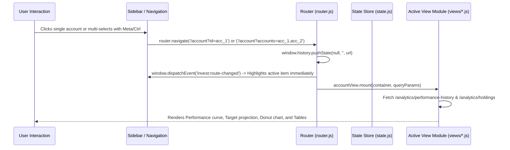

# Frontend Architecture & Modular Routing Specification (`FRONTEND_PLAN.md`)

## 1. Overview & Objectives

This specification outlines the modularization and routing architecture for the InvestTracker frontend. The goal is to transform the existing monolithic single-file client logic (`app.js`) into a clean, modular ES6-module structure with dedicated view modules and full URL routing with query parameters.

### Key Goals
1. **Dedicated View Source Files**: Each major section of the application has its own modular source file under `frontend/src/views/` (`account.js`, `real_estate.js`).
2. **Simplified, Unified View Routing & Bookmarkable URLs**: Every view and selection state corresponds to a clean URL path and query parameters:
   - `/account` (Default route & landing page): Consolidated Account & Performance dashboard handling single account (`?id=<account_id>`), multi-account (`?accounts=id1,id2`), or blended portfolio (All Accounts). When loaded without parameters, acts as the primary portfolio overview. Features Actual vs. Target performance ($ vs. % metrics), timeframe selectors (`1M`, `YTD`, `1Y`, `3Y`, `5Y`, `LIFETIME`), Chart/Table toggle, Holdings & Asset Allocation donut, and "Edit Account" configuration dialog.
   - `/real-estate`: Dedicated real estate property and mortgage equity dashboard.
3. **Flat Highlighted Sidebar**: Clean flat account list with active selection highlighting (no noisy checkboxes), supporting single-click navigation and multi-account selection (Meta/Ctrl/Shift + Click) alongside the top-level "🌟 All Accounts" row.
4. **Vanilla ES6 Modules**: Zero build step required (native browser ES modules `<script type="module" src="app.js"></script>`) maintaining high performance, instant reloads, and ease of deployment.
5. **SPA Development & Production Support**: Seamless routing in both Nginx Docker container (`try_files $uri $uri/ /index.html;`) and local development server (`python3 dev_server.py`).

---

## 2. Directory Structure & File Breakdown

```
frontend/
├── Dockerfile
├── nginx.conf
└── src/
    ├── index.html                 # App shell, persistent header, flat accounts sidebar, and dynamic view mount point (<main id="view-container">)
    ├── styles.css                 # Master design system & component styles
    ├── app.js                     # Application entry point: initializes router, auth, sidebar, and global events
    ├── state.js                   # Central reactive state management (auth, accounts cache, selection, metricUnit, timeframe)
    ├── router.js                  # Client-side router (path parsing, query param sync, instant event dispatching)
    ├── api.js                     # Unified API communication client with auth token headers and error interceptors
    ├── components/
    │   ├── header.js              # Top navigation bar, user avatar/dropdown, sync trigger, seed demo button
    │   ├── sidebar.js             # Collapsible left navigation panel, flat accounts list with active selection highlight
    │   └── modals.js              # Modal handlers: Auth, Unified Add Account, Edit Account dialog (with Delete Account CTA), Delete Confirmation, Delete Success, Delete Error, Valuation Update, Settings/Backup
    ├── views/
    │   ├── account.js             # Route: /account (Default) — Unified Performance, Target Curves, Holdings & Risk Allocation (All Accounts or single/multi-account)
    │   └── real_estate.js         # Route: /real-estate — Property cards, equity gauges, loan-to-value (LTV) ratios
    └── utils/
        ├── formatters.js          # Currency, percentage, and date formatting utilities
        └── dom.js                 # DOM helper utilities (safe escaping, element creation)
```

---

## 3. URL Route Specifications & Parameter Contracts

### 3.1 Route Map

| Route Path | View Module | URL Query Parameters | Description |
| :--- | :--- | :--- | :--- |
| `/` or `/account` | `views/account.js` | `id` (Single account UUID, e.g. `?id=93f3cf72-...`)<br>`accounts` (Comma-separated account IDs for multi-select)<br>`unit` (`pct` or `dollar`)<br>`timeframe` (`1M`, `YTD`, `1Y`, `3Y`, `5Y`, `LIFETIME`)<br>`tab` (`performance`, `holdings`)<br>`search` (Holdings search query) | Default landing view and consolidated account & performance view for single, multi, or blended accounts. Includes metric toggles (% vs $), horizon buttons, Chart vs Table toggle, Holdings allocation donut, and "Edit Account" modal action (with permanent account deletion, irreversible confirmation prompt, and cascade cleanup). Legacy `/overview` automatically redirects to `/account`. |
| `/real-estate` | `views/real_estate.js` | `id` (Optional property account ID to highlight/filter) | Physical property assets, market valuations, attached mortgages, and net equity tracking. |

### 3.2 URL Synchronization Workflow



---

## 4. Component & View Interfaces

Each view module adheres to a standard lifecycle interface:

```javascript
export default {
  /**
   * Renders the HTML structure and mounts event listeners into the container.
   * @param {HTMLElement} container - The #view-container element.
   * @param {URLSearchParams} params - Parsed query parameters from the router.
   */
  async mount(container, params) {},

  /**
   * Cleans up Chart.js instances, timers, or window listeners when navigating away.
   */
  unmount() {}
};
```

---

## 5. Local Development Server (`dev_server.py`)

To enable seamless client-side SPA routing during local development without requiring Docker or Nginx:
- A lightweight Python HTTP server (`dev_server.py`) serves static files from `frontend/src/` and redirects all non-file route requests (`/account`, `/real-estate`, `/overview`) back to `index.html`.
- `run_local.sh` launches `dev_server.py` on port `3010`.

---

## 6. Implementation & Verification Status

1. **Architecture & Modularization**: Completed
   - Core: `state.js`, `api.js`, `formatters.js`, `router.js`.
   - Views: `views/account.js` (default), `views/real_estate.js`.
   - Components: `components/sidebar.js`, `components/header.js`, `components/modals.js`.
2. **Simplified Navigation & Account Actions**: Completed
   - Flat accounts list in sidebar with selection highlights (no checkboxes).
   - "Edit Account" settings dialog accessible from header button on `/account`, supporting metadata/target updates and permanent account deletion with irreversible confirmation, child record cascade cleanup, success notification, error handling, and reactive sidebar refresh.
   - Unified Chart/Table switcher, % vs $ metric unit toggles, and timeframe buttons.
3. **Automated End-to-End Testing (Playwright + TypeScript)**: Completed
   - Complete test suite passing across all test suites (`e2e/`).
   - Covered in detail under `specs/FRONTEND_TEST_PLAN.md`.
