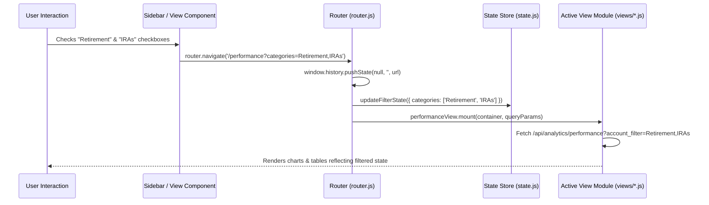

# Frontend Architecture & Modular Routing Specification (`FRONTEND_PLAN.md`)

## 1. Overview & Objectives

This specification outlines the modularization and routing architecture for the InvestTracker frontend. The goal is to transform the existing monolithic single-file client logic (`app.js`) into a clean, modular ES6-module structure with dedicated view modules and full URL routing with query parameters.

### Key Goals
1. **Dedicated View Source Files**: Each major section of the application will have its own modular source file under `frontend/src/views/`.
2. **Deep-Linking & Bookmarkable URLs**: Every view and filter state will correspond to a distinct URL path and query parameters:
   - `/overview` (Default route): High-level portfolio summary & 7 category KPI cards.
   - `/performance`: Filtered performance & target curves, risk allocation, holdings with query parameters (`?categories=Retirement,IRAs`, `?accounts=acc_id_1,acc_id_2`, `?timeframe=1Y`, `?tab=performance|holdings`).
   - `/account`: Detailed view for an individual account (`?id=<account_id>`) with target return configuration, historical snapshots, linked loans, and transaction history.
   - `/real-estate`: Dedicated real estate property and mortgage equity dashboard.
3. **Vanilla ES6 Modules**: Zero build step required (native browser ES modules `<script type="module" src="app.js"></script>`) maintaining high performance, instant reloads, and ease of deployment.
4. **SPA Development & Production Support**: Seamless routing in both Nginx Docker container (`try_files $uri $uri/ /index.html;`) and local development server (`python3 dev_server.py`).

---

## 2. Directory Structure & File Breakdown

```
frontend/
├── Dockerfile
├── nginx.conf
└── src/
    ├── index.html                 # App shell, persistent header, sidebar, and dynamic view mount point (<main id="view-container">)
    ├── styles.css                 # Master design system & component styles
    ├── app.js                     # Application entry point: initializes router, auth, sidebar, and global events
    ├── state.js                   # Central reactive state management (auth, accounts cache, active filters)
    ├── router.js                  # Client-side router (path parsing, query param sync, History API pushState/popstate)
    ├── api.js                     # Unified API communication client with auth token headers and error interceptors
    ├── components/
    │   ├── header.js              # Top navigation bar, user avatar/dropdown, sync trigger, seed demo button
    │   ├── sidebar.js             # Collapsible left navigation panel, filter multi-selectors, dynamic accounts list
    │   └── modals.js              # Modal handlers: Auth, Unified 3-tab Add Account, Valuation Update, Settings/Backup
    ├── views/
    │   ├── overview.js            # Route: / or /overview — 7 Account Filter KPI panels & Capital Structure Breakdown
    │   ├── performance.js         # Route: /performance — Actual vs Target charts, Risk Donut, Holdings Table, TF metrics
    │   ├── account.js             # Route: /account — Single Account Detail View (?id=<account_id>), Target Rate editor, History
    │   └── real_estate.js         # Route: /real-estate — Property cards, equity gauges, loan-to-value (LTV) ratios
    └── utils/
        ├── formatters.js          # Currency, percentage, and date formatting utilities
        └── dom.js                 # DOM helper utilities (safe escaping, element creation)
```

---

## 3. URL Route Specifications & Parameter Contracts

### 3.1 Route Map

| Route Path | View Module | URL Query Parameters | Description |
| :--- | :--- | :--- | :--- |
| `/` or `/overview` | `views/overview.js` | *None* | Default dashboard landing page with 7 summary KPI panels matching sidebar filters. |
| `/performance` | `views/performance.js` | `categories` (comma-separated, e.g. `Retirement,IRAs`)<br>`accounts` (comma-separated account IDs)<br>`timeframe` (`1M`, `YTD`, `1Y`, `3Y`, `5Y`, `LIFETIME`)<br>`tab` (`performance`, `holdings`)<br>`search` (holdings search query) | Comprehensive filtered performance view. URL updates dynamically on filter change to allow bookmarking/sharing exact filter views. |
| `/account` | `views/account.js` | `id` (Required UUID of the account, e.g. `?id=93f3cf72-...`)<br>`tab` (`overview`, `history`, `settings`) | Deep-dive account view showing current balance, historical performance graph, target return configuration, linked asset details, and manual balance loggers. |
| `/real-estate` | `views/real_estate.js` | `id` (Optional property account ID to highlight/filter) | Physical property assets, market valuations, attached mortgages, and net equity tracking. |

### 3.2 URL Synchronization Workflow



---

## 4. Component & View Interfaces

Each view module adheres to a standard lifecycle interface:

```javascript
export default {
  /**
   * Renders the HTML structure and mounts event listeners into the container.
   * @param {HTMLElement} container - The #view-container element.
   * @param {URLSearchParams} params - Parsed query parameters from the router.
   */
  async mount(container, params) {},

  /**
   * Called when query parameters change without changing the base route (e.g. timeframe change).
   * @param {URLSearchParams} params - Updated query parameters.
   */
  async update(params) {},

  /**
   * Cleans up Chart.js instances, timers, or window listeners when navigating away.
   */
  unmount() {}
};
```

---

## 5. Local Development Server (`dev_server.py`)

To enable seamless client-side SPA routing during local development without requiring Docker or Nginx:
- A lightweight Python HTTP server (`dev_server.py`) will be added to serve static files from `frontend/src/` and redirect all non-file route requests (`/overview`, `/performance`, `/account`) back to `index.html`.
- Updated `run_local.sh` to launch `dev_server.py` on port `3010`.

---

## 6. Implementation Phases

1. **Phase 1: Foundation & State / API / Router Modularization**
   - Create `state.js`, `api.js`, `formatters.js`, and `router.js`.
   - Setup `dev_server.py` and update `run_local.sh` for SPA routing fallback.
2. **Phase 2: View Modularization**
   - Extract `views/overview.js` for the `/overview` route.
   - Extract `views/performance.js` for the `/performance` route with full query parameter syncing (`categories`, `accounts`, `timeframe`, `tab`).
   - Extract `views/account.js` for the `/account` route with individual account deep-dive metrics and target rate adjustment.
   - Extract `views/real_estate.js` for `/real-estate`.
3. **Phase 3: Component Extraction & App Shell Refactoring**
   - Extract `components/sidebar.js`, `components/header.js`, and `components/modals.js`.
   - Streamline `index.html` to serve as a clean application shell with persistent navigation and `#view-container`.
4. **Phase 4: Verification & Automated Testing**
   - Verify URL navigation, back/forward browser button support, filter bookmarking, and local dev server.
   - Run backend test suite to ensure complete end-to-end compatibility.
